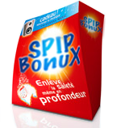

# SPIP-Bonux

 Le plugin qui lave plus SPIP que SPIP, avec des chouettes cadeaux dedans

## License

[GPL 3.0](LICENSE)

## Installation

```bash
composer require spipremix/bonux
```

## Documenation

[SPIP-Contrib](https://contrib.spip.net/Bonux-pour-SPIP3)